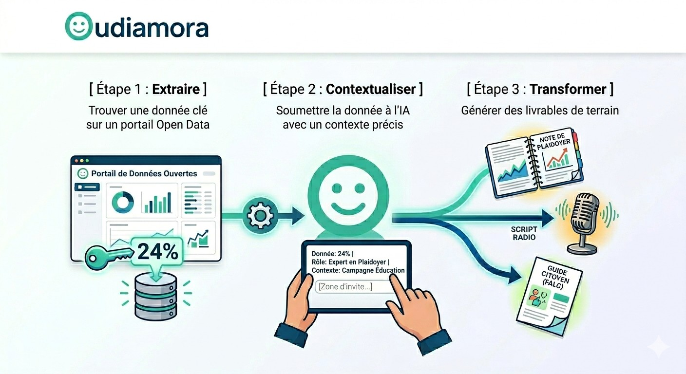

# ⚡ Combiner Open Data & IA Générative : La Méthode

Pour maximiser l'impact de votre OSC, n'utilisez pas l'IA dans le vide. Nourrissez-la avec des données ouvertes et vérifiées. Voici la méthode en 3 étapes que nous enseignent dans nos ateliers pilotes.

---

## 🧭 Le Flux de Travail (Workflow) en 3 étapes

[ Étape 1 : Extraire ] -> Trouver un chiffre clé sur un portail Open Data.
[ Étape 2 : Contextualiser ] -> Donner ce chiffre à l'IA avec un rôle précis.
[ Étape 3 : Transformer ] -> Obtenir un livrable terrain (Plaidoyer, Radio, FALC).
